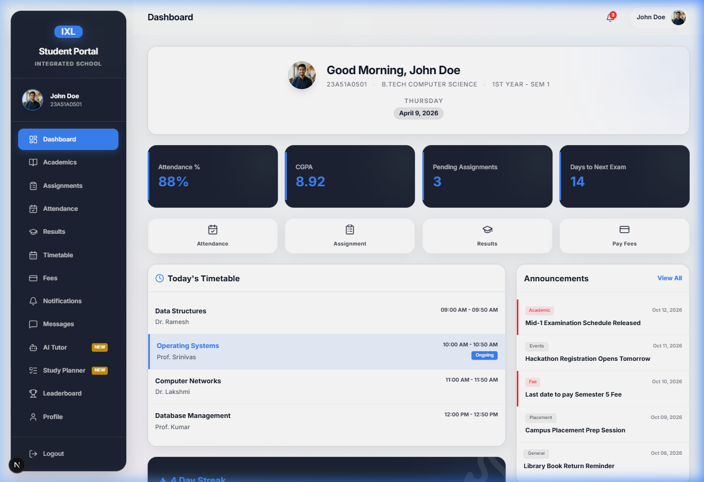
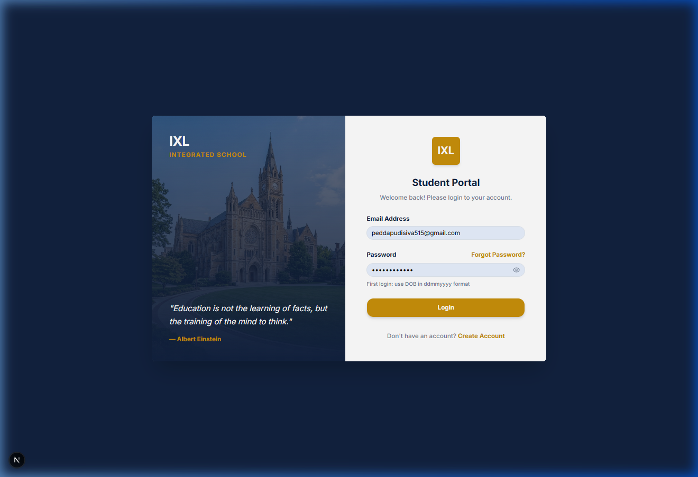

# 🎓 IXL Integrated School Student Portal

[](https://opensource.org/licenses/MIT)
[](https://nextjs.org/)
[](https://tailwindcss.com/)
[](https://supabase.com/)
[](https://vercel.com/)

A premium, feature-rich Student Portal designed for **IXL Integrated School**. This application provides a seamless experience for students to manage their academics, attendance, and AI-driven learning.

---

## 📸 Visual Overview

### **Modern Dashboard**
*Real-time highlights of attendance, GPA, and pending tasks.*


### **Secure Login**
*Branded authentication with prestigious institution aesthetics.*


---

## 🚀 Key Features

- **📊 Intelligent Dashboard**: Unified view of academic progress, upcoming exams, and today's timetable.
- **🤖 AI Academic Tutor**: A personalized AI assistant that has context of your courses and helps with complex topics.
- **📅 Smart Attendance**: Visual gauge tracking with automated "Low Attendance" warnings.
- **📝 Assignments & Results**: Comprehensive management of submissions and marks history with internal grade calculation.
- **🏆 Leaderboard**: Healthily competitive academic rankings within the department.
- **🏢 Campus Modules**: Integrated Leave Application, Fee Management, and Official Notifications.

---

## 🛠️ Tech Stack

- **Framework**: [Next.js 14+](https://nextjs.org/) (App Router)
- **Styling**: [Tailwind CSS](https://tailwindcss.com/)
- **State Management**: [React Hooks](https://reactjs.org/)
- **Animations**: [Framer Motion](https://www.framer.com/motion/)
- **Database**: [Supabase](https://supabase.com/) (PostgreSQL + Auth)
- **Icons**: [Lucide React](https://lucide.dev/)
- **UI Components**: [Radix UI](https://www.radix-ui.com/) + [Shadcn/UI](https://ui.shadcn.com/)

---

## 📦 Getting Started

### 1. Clone the Repository
```bash
git clone https://github.com/peddapudisiva/Student-portal-page.git
cd Student-portal-page
```

### 2. Install Dependencies
```bash
npm install
```

### 3. Set Up Environment Variables
Create a `.env.local` file in the root directory:
```env
NEXT_PUBLIC_SUPABASE_URL=your_supabase_url
NEXT_PUBLIC_SUPABASE_ANON_KEY=your_supabase_anon_key
NEXT_PUBLIC_GEMINI_API_KEY=your_google_ai_key
```

### 4. Run Development Server
```bash
npm run dev
```

---

## 🤝 Contact

**Siva Peddapudi**  
[](https://linkedin.com/in/peddapudisiva)

Project Link: [https://github.com/peddapudisiva/Student-portal-page](https://github.com/peddapudisiva/Student-portal-page)

---

Developed with ❤️ for IXL Integrated School.
